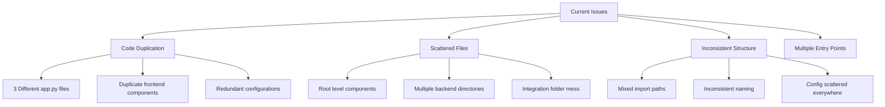
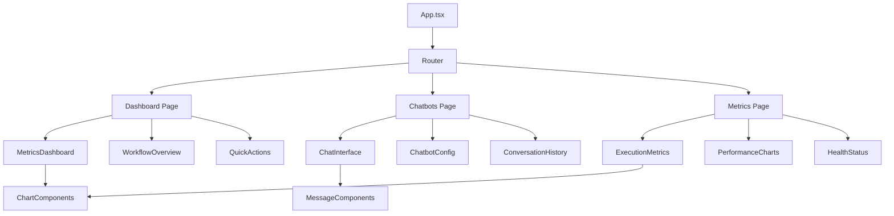
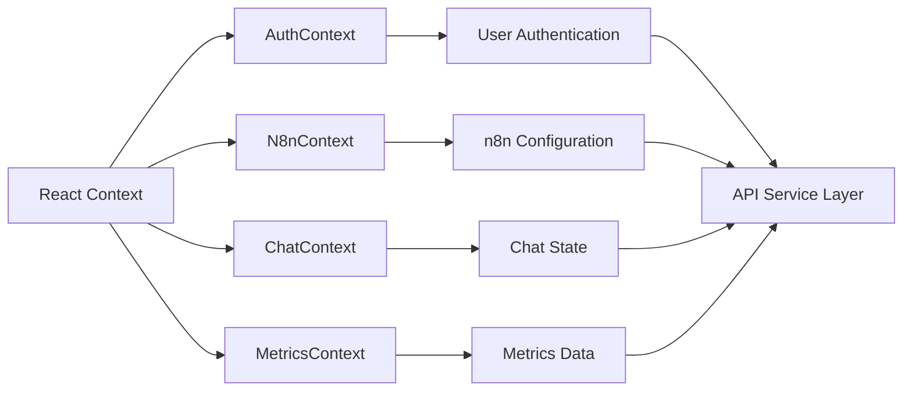
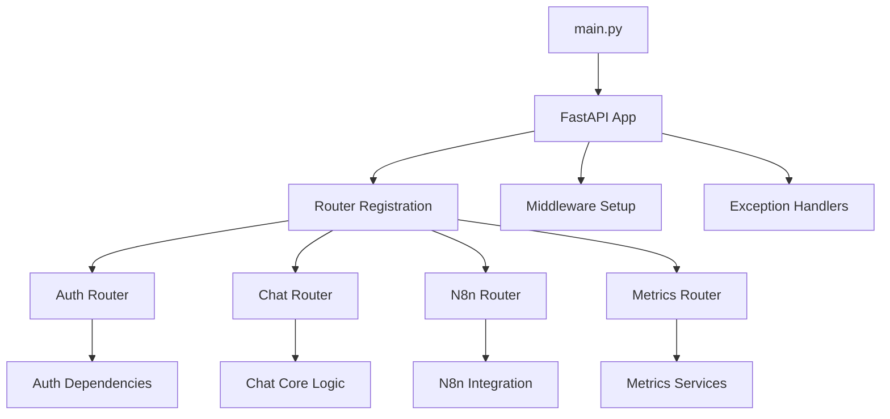
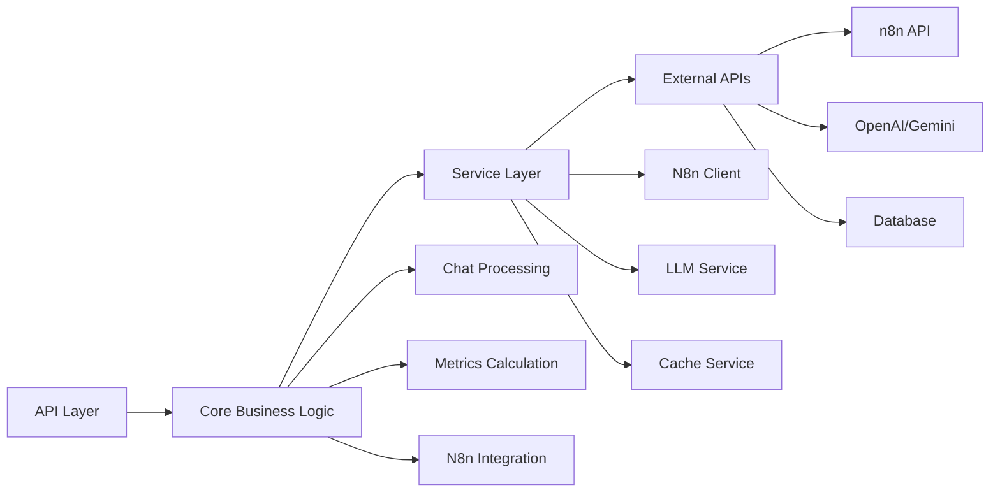
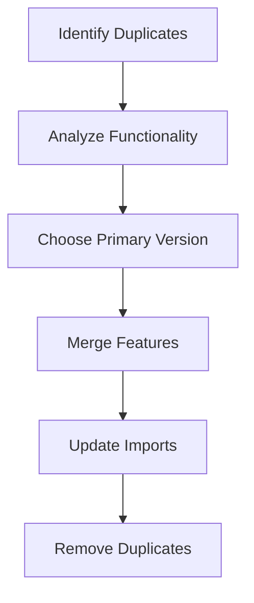
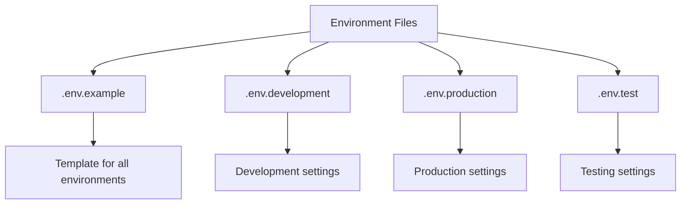
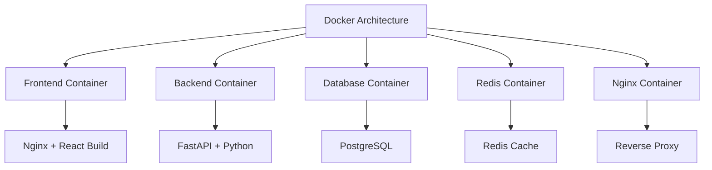

# FlowMastery Project Structure Refactoring Design

## Overview

This design document outlines the comprehensive refactoring of the FlowMastery n8n platform to eliminate code duplication, establish clear architectural boundaries, and create a maintainable monorepo structure. The current project has significant structural issues with duplicate files, scattered code, and inconsistent organization across multiple directories.

## Current Project Analysis

### Repository Type Detection
**Full-Stack Application** - The project contains both React frontend and FastAPI backend components with n8n integration capabilities.

### Current Structure Issues



### File Duplication Matrix

| File Type | Locations | Status |
|-----------|-----------|---------|
| `app.py` | `/backend/`, `/To integrate/`, `/packages/backend/app/main.py` | **3 versions with different functionality** |
| Frontend Components | `/src/`, `/packages/frontend/src/` | **Duplicate React components** |
| Configuration | `/backend/config.py`, `/To integrate/config.py`, `/packages/backend/app/config.py` | **Multiple config files** |
| N8N Integration | `/backend/n8n_*.py`, `/To integrate/n8n_*.py`, `/packages/backend/app/n8n_*.py` | **Scattered integration logic** |

## Target Architecture

### Proposed Monorepo Structure

```
flowmastery-n8n-platform/
├── packages/
│   ├── frontend/                    # React TypeScript Application
│   │   ├── src/
│   │   │   ├── components/         # Reusable UI Components
│   │   │   │   ├── common/         # Generic components
│   │   │   │   ├── n8n/           # n8n-specific components
│   │   │   │   └── charts/        # Data visualization
│   │   │   ├── pages/             # Route-based pages
│   │   │   │   ├── Dashboard/     # Main dashboard
│   │   │   │   ├── Chatbots/      # Chatbot management
│   │   │   │   └── Metrics/       # Analytics & metrics
│   │   │   ├── services/          # API integration layer
│   │   │   │   ├── api.ts         # Base API client
│   │   │   │   ├── n8nService.ts  # n8n API wrapper
│   │   │   │   └── chatService.ts # Chat functionality
│   │   │   ├── hooks/             # Custom React hooks
│   │   │   ├── contexts/          # React Context providers
│   │   │   ├── utils/             # Helper functions
│   │   │   ├── types/             # TypeScript definitions
│   │   │   └── config/            # Frontend configuration
│   │   ├── public/                # Static assets
│   │   ├── tests/                 # Frontend tests
│   │   └── docs/                  # Component documentation
│   │
│   ├── backend/                     # FastAPI Python Application
│   │   ├── app/
│   │   │   ├── api/               # API route handlers
│   │   │   │   ├── v1/            # API version 1
│   │   │   │   │   ├── auth.py    # Authentication endpoints
│   │   │   │   │   ├── chat.py    # Chat endpoints
│   │   │   │   │   ├── n8n.py     # n8n integration endpoints
│   │   │   │   │   └── metrics.py # Metrics endpoints
│   │   │   │   └── dependencies.py # Shared dependencies
│   │   │   ├── core/              # Business logic layer
│   │   │   │   ├── chat/          # Chat processing logic
│   │   │   │   ├── n8n/           # n8n integration logic
│   │   │   │   ├── metrics/       # Metrics calculation
│   │   │   │   └── config/        # Configuration management
│   │   │   ├── models/            # Pydantic models
│   │   │   │   ├── chat.py        # Chat-related models
│   │   │   │   ├── n8n.py         # n8n-related models
│   │   │   │   └── metrics.py     # Metrics models
│   │   │   ├── services/          # External service integrations
│   │   │   │   ├── n8n_client.py  # n8n API client
│   │   │   │   ├── llm_service.py # LLM integration
│   │   │   │   └── cache_service.py # Caching layer
│   │   │   ├── utils/             # Utility functions
│   │   │   └── main.py            # FastAPI application entry
│   │   ├── tests/                 # Backend tests
│   │   │   ├── unit/              # Unit tests
│   │   │   ├── integration/       # Integration tests
│   │   │   └── fixtures/          # Test fixtures
│   │   └── migrations/            # Database migrations
│   │
│   └── shared/                      # Shared utilities & types
│       ├── types/                 # Common TypeScript/Python types
│       ├── constants/             # Shared constants
│       └── utils/                 # Cross-platform utilities
│
├── config/                          # Project-wide configuration
│   ├── docker/                    # Docker configurations
│   ├── nginx/                     # Nginx configurations
│   └── environments/              # Environment-specific configs
│
├── scripts/                         # Build & deployment scripts
│   ├── setup/                     # Initial setup scripts
│   ├── build/                     # Build scripts
│   └── deploy/                    # Deployment scripts
│
├── docs/                           # Project documentation
│   ├── api/                       # API documentation
│   ├── architecture/              # Architecture diagrams
│   └── guides/                    # User guides
│
└── tools/                          # Development tools
    ├── linting/                   # Linting configurations
    └── testing/                   # Testing configurations
```

## Frontend Architecture Refactoring

### Component Hierarchy



### State Management Architecture



### API Integration Layer

| Service | Responsibility | Endpoints |
|---------|---------------|-----------|
| `n8nService.ts` | n8n API integration | `/api/v1/n8n/*` |
| `chatService.ts` | Chat functionality | `/api/v1/chat/*` |
| `metricsService.ts` | Analytics data | `/api/v1/metrics/*` |
| `authService.ts` | Authentication | `/api/v1/auth/*` |

## Backend Architecture Refactoring

### FastAPI Application Structure



### Service Layer Architecture



### Data Models & Schema

| Model Category | Models | Purpose |
|---------------|--------|---------|
| **Chat Models** | `ChatMessage`, `ChatResponse`, `Conversation` | Chat functionality |
| **N8n Models** | `N8nConfig`, `WorkflowExecution`, `N8nQuery` | n8n integration |
| **Metrics Models** | `ExecutionMetrics`, `PerformanceData` | Analytics |
| **Auth Models** | `User`, `Token`, `Permission` | Authentication |

## Code Consolidation Strategy

### Phase 1: Duplicate File Resolution



#### Backend Consolidation Matrix

| Current Files | Action | Target Location |
|--------------|--------|-----------------|
| `/backend/app.py` | **PRIMARY** - Most complete FastAPI implementation | `packages/backend/app/main.py` |
| `/To integrate/app.py` | **MERGE** - Extract Streamlit UI components | Integrate chat logic into main |
| `/packages/backend/app/main.py` | **UPDATE** - Already in correct location | Enhance with missing features |

#### Frontend Consolidation Matrix

| Current Files | Action | Target Location |
|--------------|--------|-----------------|
| `/src/*` | **MOVE** - All root components | `packages/frontend/src/` |
| `/packages/frontend/src/*` | **PRIMARY** - Keep as main structure | Enhance with root components |
| Component duplicates | **MERGE** - Combine functionality | Single component per feature |

### Phase 2: Configuration Unification

#### Environment Configuration Strategy



#### Unified Configuration Schema

```typescript
interface AppConfig {
  environment: 'development' | 'production' | 'test';
  api: {
    baseUrl: string;
    timeout: number;
  };
  n8n: {
    apiUrl: string;
    apiKey: string;
    webhookUrl: string;
  };
  database: {
    url: string;
    poolSize: number;
  };
  cache: {
    redisUrl: string;
    ttl: number;
  };
  auth: {
    secretKey: string;
    tokenExpiry: number;
  };
}
```

### Phase 3: Import Path Standardization

#### TypeScript Path Mapping

```json
{
  "compilerOptions": {
    "baseUrl": "./src",
    "paths": {
      "@/*": ["*"],
      "@components/*": ["components/*"],
      "@pages/*": ["pages/*"],
      "@services/*": ["services/*"],
      "@utils/*": ["utils/*"],
      "@types/*": ["types/*"],
      "@config/*": ["config/*"],
      "@shared/*": ["../../shared/*"]
    }
  }
}
```

#### Python Import Structure

```python
# API Layer Imports
from app.api.v1 import auth, chat, n8n, metrics

# Core Logic Imports
from app.core.chat import ChatProcessor
from app.core.n8n import N8nIntegration
from app.core.metrics import MetricsCalculator

# Service Layer Imports
from app.services.n8n_client import N8nClient
from app.services.llm_service import LLMService

# Model Imports
from app.models.chat import ChatMessage, ChatResponse
from app.models.n8n import N8nConfig, WorkflowExecution
```

## Testing Strategy

### Simple Testing Structure

```
packages/
├── frontend/
│   └── tests/
│       ├── components/          # Component tests
│       ├── pages/              # Page tests
│       └── utils/              # Utility tests
│
└── backend/
    └── tests/
        ├── api/                # API endpoint tests
        ├── core/               # Business logic tests
        └── fixtures/           # Test data
```

#### Testing Framework Configuration

| Component | Framework | Purpose |
|-----------|-----------|----------|
| **Frontend** | Jest + React Testing Library | Component and utility testing |
| **Backend** | Pytest | API and business logic testing |
| **Linting** | ESLint + Prettier (Frontend), Black + PyLint (Backend) | Code quality |
| **Type Checking** | TypeScript (Frontend), MyPy (Backend) | Type safety |

## Migration Implementation Plan

### Phase 1: Foundation Setup (Week 1)

1. **Repository Structure Creation**
   - Create new monorepo structure
   - Set up package.json workspaces
   - Configure TypeScript/Python path mappings

2. **Configuration Consolidation**
   - Merge all environment files
   - Create unified configuration schema
   - Set up Docker configurations

### Phase 2: Backend Consolidation (Week 2)

1. **FastAPI Application Merge**
   - Analyze all three app.py versions
   - Merge functionality into single main.py
   - Implement proper routing structure

2. **Service Layer Creation**
   - Extract n8n integration logic
   - Create service abstractions
   - Implement caching layer

### Phase 3: Frontend Refactoring (Week 3)

1. **Component Migration**
   - Move all components to proper structure
   - Eliminate duplicates
   - Implement proper component hierarchy

2. **State Management Setup**
   - Implement React Context providers
   - Create custom hooks
   - Set up API service layer

### Phase 4: Clean Up & Documentation (Week 4)

1. **Final Clean Up**
   - Remove all duplicate files
   - Verify import paths
   - Test basic functionality

2. **Essential Documentation**
   - Update README with new structure
   - Basic API documentation
   - Setup instructions

## Docker & Deployment Configuration

### Containerization Strategy



### Service Communication

| Service | Port | Internal URL | External URL |
|---------|------|--------------|---------------|
| **Frontend** | 5173 | `http://frontend:5173` | `http://localhost:5173` |
| **Backend** | 8000 | `http://backend:8000` | `http://localhost:8000` |
| **Database** | 5432 | `http://postgres:5432` | `localhost:5432` |
| **Redis** | 6379 | `http://redis:6379` | `localhost:6379` |
| **Nginx** | 80/443 | - | `http://localhost` |

## Clean Final Structure

### Complete Directory Layout

```
flowmastery-n8n-platform/
├── packages/
│   ├── frontend/                    # React App
│   │   ├── src/
│   │   │   ├── components/         # All UI components
│   │   │   ├── pages/              # Route pages
│   │   │   ├── services/           # API calls
│   │   │   ├── hooks/              # Custom hooks
│   │   │   ├── utils/              # Helper functions
│   │   │   ├── types/              # TypeScript types
│   │   │   └── config/             # Frontend config
│   │   ├── tests/                  # Frontend tests
│   │   ├── package.json
│   │   ├── vite.config.ts
│   │   └── tsconfig.json
│   │
│   └── backend/                     # FastAPI App
│       ├── app/
│       │   ├── api/                # API routes
│       │   ├── core/               # Business logic
│       │   ├── models/             # Data models
│       │   ├── services/           # External services
│       │   ├── utils/              # Helper functions
│       │   └── main.py             # App entry point
│       ├── tests/                  # Backend tests
│       └── requirements.txt
│
├── docker-compose.yml              # Container orchestration
├── .env                           # Environment variables
├── package.json                   # Root package config
└── README.md                      # Project documentation
```

### Key Principles

1. **Single Source of Truth** - No duplicate files
2. **Clear Separation** - Frontend and backend completely separated
3. **Logical Grouping** - Related files grouped together
4. **Simple Navigation** - Easy to find any file
5. **Standard Conventions** - Following industry best practices

## Essential Configuration

### Environment Setup

1. **Frontend Configuration**
   - Environment variables for API URLs
   - Build configurations for different environments
   - TypeScript strict mode

2. **Backend Configuration**
   - FastAPI settings
   - Database connections
   - n8n integration settings

### Docker Configuration

1. **Development Environment**
   - Simple docker-compose setup
   - Hot reload for development
   - Easy service communication

2. **Production Ready**
   - Optimized container builds
   - Health checks
   - Basic security settings